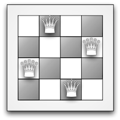

# N-Queens Problem


## Overview

Can $n$ queens (of the same colour) be placed on a $n\times n$ chessboard so that none of the  queens can attack each other?

In chess a queen attacks other squares on the same row, column, or either diagonal as itself. So the $n$-queens problem is to find a set of $n$ locations on a chessboard, no two of which are on the same row, column or diagonal.

<center>
    <figure>
        
        <figcaption>A solution to 4-queens</figcaption>
    </figure>
</center>

[Read More](docs/problem/specification.md)


## Modeling

Next, I'll illustrate Constraint Programming (CP) by a Combinatorial Problem based on the game of chess. In chess, a queen can attack horizontally, vertically, and diagonally. The N-Queens Problem asks:

> How can N Queens be placed on an NxN chessboard so that no two of them attack each other?

Note that this isn't an Optimization Problem: We want to find all possible solutions, rather than one optimal solution, which makes it a natural candidate for constraint programming. The following sections describe the CP Approach to the N-Queens Problem, and present Python Solution that solve it using the CP-SAT Solver.

### Constraints Declaration

Here is the code that creates the constraints for the problem.
Note: The entire solution file could be found [here](src/solvers/cp_sat.py).

``` Python
self._model = cp_model.CpModel()

queens = [
    self._model.NewIntVar(0, self._n - 1, 'x%i' % i)
    for i in range(self._n)
]

# Constraint: All Queens should be in Different Rows
self._model.AddAllDifferent(queens)

# Constraint: No Two Queens should be on the Same Diagonal
for i in range(self._n):

    diag1 = []
    diag2 = []

    for j in range(self._n):

        q1 = self._model.NewIntVar(0, 2 * self._n, 'diag1_%i' % i)
        diag1.append(q1)
        self._model.Add(q1 == queens[j] + j)

        q2 = self._model.NewIntVar(-self._n, self._n, 'diag2_%i' % i)
        diag2.append(q2)
        self._model.Add(q2 == queens[j] - j)

    self._model.AddAllDifferent(diag1)
    self._model.AddAllDifferent(diag2)
```

The code uses the `AddAllDifferent` Method, which requires all the elements of a variable array to be different.

Let's see how these constraints guarantee the three conditions for the N-Queens Problem (queens on different rows, columns, and diagonals).

#### No Two Queens on the Same Row

Applying the solver's `AllDifferent` Method to `queens` forces the values of `queens[j]` to be different for each `j`, which means that all queens must be in different rows.

#### No Two Queens on the Same Column

This constraint is implicit in the definition of `queens`. Since no two elements of `queens` can have the same index, no two queens can be in the same column.

#### No Two Queens on the Same Diagonal

The diagonal constraint is a little trickier than the row and column constraints. First, if two queens lie on the same diagonal, one of the following conditions must be true:

- The row number plus the column number for each of the two queens are equal. In other words, `queens(j) + j` has the same value for two different indices `j`.
- The row number minus the column number for each of the two queens are equal. In this case, `queens(j) - j` has the same value for two different indices `j`.

One of these conditions means the queens lie on the same ascending diagonal (going from left to right), while the other means they lie on the same descending diagonal. Which condition corresponds to ascending and which to descending depends on how you order the rows and columns. The ordering has no effect on the set of solutions.

So the diagonal constraint is that the values of `queens(j) + j` must all be different, and the values of `queens(j) - j` must all be different, for different `j`.

To apply the `AddAllDifferent` Method to `queens(j) + j`, we put the `N` instances of the variable, for `j` from `0` to `N - 1`, into an array, `diag1`, as follows:

``` Python
q1 = self._model.NewIntVar(0, 2 * self._n, 'diag1_%i' % i)
diag1.append(q1)
self._model.Add(q1 == queens[j] + j)
```

Then we apply `AddAllDifferent` to `diag1`.

``` Python
self._model.AddAllDifferent(diag1)
```

The constraint for `queens(j) - j` is created similarly.

### Results

Running the program.

``` Bash
# Usage: python main.py <solver> <board-size> <print-solutions>
python main.py cp-sat 5 Yeah
```

The number of solutions goes up roughly exponentially with the size of the board.

| Board Size | Solutions | Execution Time (ms) |
| :--------: | :-------: | :-----------------: |
|     1      |     1     |          0          |
|     2      |     0     |          0          |
|     3      |     0     |          0          |
|     4      |     2     |          0          |
|     5      |    10     |          0          |
|     6      |     4     |          0          |
|     7      |    40     |          3          |
|     8      |    92     |          9          |
|     9      |    352    |         35          |
|     10     |    724    |         95          |
|     11     |   2680    |         378         |
|     12     |   14200   |        2198         |
|     13     |   73712   |        11628        |
|     14     |  365596   |        62427        |
|     15     |  2279184  |       410701        |

Many solutions are just rotations of others, and a technique called symmetry breaking can be used to reduce the amount of computation needed. It is not used here; the solution above isn't intended to be fast, just simple. Of course, we could make it much faster if we want to, only find one solution instead of all of them: no more than a few milliseconds for board sizes up to 50.


## Simple Backtracking Solution

The idea is to place queens, one by one, in different columns, starting from the left-most column. When we place a queen in a column, we check for clashes with already placed queens. In the current column, if we find a row for which there is no clash, we mark this row and column as part of the solution. If we do not find such a row due to clashes then we backtrack and return false.

The implementation could be viewed [here](src/solvers/backtracking.py).

Running the program.

``` Bash
# Usage: python main.py <solver> <board-size> <print-solutions>
python main.py backtracking 5 Yeah
```
